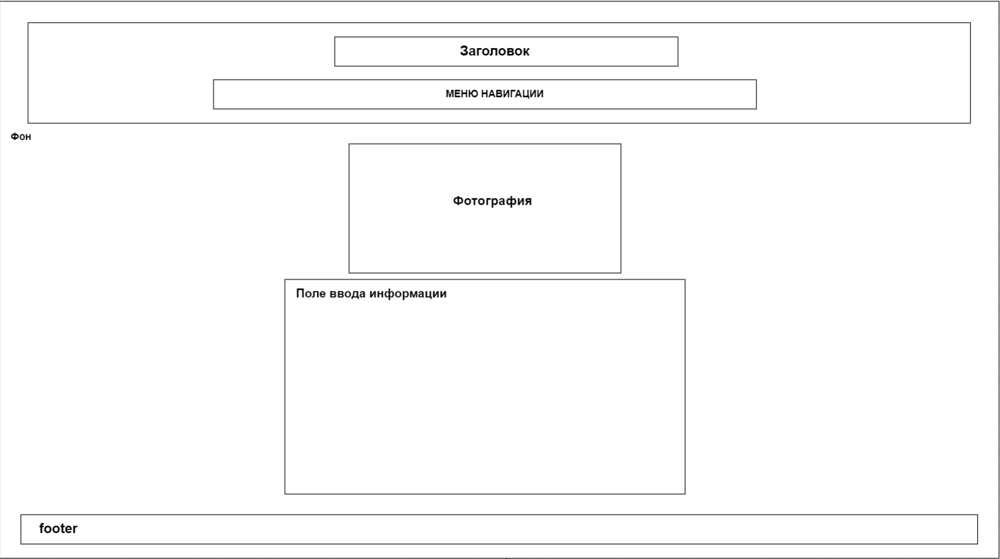

# Проектная работа

**Студент:** Нилогов Сергей Александрович

**Группа:** M33121

**ИСУ:** 332955

### Тема лабораторной работы:
Сайт о моем родном городе - Салехарде

### Мой девиз:
Минимализм всему, везде и сразу.

### Схема страницы сайта




## Use-Case сценарии с использованием выбранных мною библиотек:

### Swiper (Слайдер для галереи фотографий на странице погоды): weather
Сценарий: Человек посещает страницу с погодой. И на этой странице реализована галерея, оформленная в виде слайдера с эффектом "coverflow". Пользователь может листать фотографии, используя курсор.
Цель: Сделать интересную и красивую анимацию скроллинга фотографий.

### Toastr (Уведомления о действиях в интер. табл.): planer
Сценарий: После сохранения расписания пользователь получит уведомление в верхнем правом углу экрана, которое подтверждает успешное сохранение события.
Цель: Существует интерактивная кнопка, при нажатии которой происходит определенное действие, но не всегда пользователь может понять, совершено это действие или нет. Для этого необходимо добавить уведомление.

### SweetAlert (Модальные окна, для комментариев): comments
Сценарий: При успешной отправке комментария на странице фотографий, пользователь видит уже оформленное модальное окно с сообщением об успешной отправке.
Цель: Аналогична предыдущей.


# ПРАВКИ:

1. Добавил по условию лабы, то чего не хватало - uppercase

2. Исправил тип шрифта, читаемый везде

3. ex->rem

4. Наладил псевдокод

# ПРАВКИ(глобальные):
1. Пересмотрел свое отношение. Изменил названия файлов, их структуру.

2. Вопрос: связанный с указанием цвета.

3. Вопрос: Если добавлять в свой проект шрифты, как сделат так, чтобы они у всех отображались корректно. Исключить их возможное исчезновение.

4. Исключил белые отступы вокруг подвала

5. Настройка Swiper в погоде

6. Тщательная настройка header

7. Переосмысление страницы с фотографиями. Обший стиль header.

8. Псевдографика работает корректно 

9. Добваил подвал на страницу фотографий


10. СДЕЛАТЬ так, чтобы активное меню при масштабировании становилось вертикальным

11. Указал размер шрифта в rem.

12. Исправил вывод времени загрузки в секундах. Проблема была в использловании устаревшено формата timing. Использую строгое правило.

- 1 (Устарело)
```html
(function () {
    'use strict'; /* Строго */
    // Отслеживание времени загрузки
    window.addEventListener('load', function () {
        let loadTime = performance.timing.domContentLoadedEventEnd - performance.timing.navigationStart; /* Устарело */
        let footer = document.querySelector('footer');
        if (footer) {
            footer.innerHTML += `<p>Время загрузки: ${loadTime}ms</p>`;
        }
    });
```
- 2 (Выводит Dom)
```html
;(function () {
	'use strict'
	window.addEventListener('load', function () {
		let perfEntries = performance.getEntriesByType('navigation')
		if (perfEntries.length > 0) {
			let p = perfEntries[0]
			let loadTime = p.domContentLoadedEventEnd - p.startTime /* Вот loadEventEnd */
			let footer = document.querySelector('footer')
			if (footer) {
				footer.innerHTML += `<p>Время загрузки: ${loadTime}ms</p>`
			}
		}
	})
```

- 3 (Выводит полное время заграузки DOM + все остальное + задержка)
```html
;(function () {
    'use strict';
    window.onload = function() {
        setTimeout(function() {
            let perfEntries = performance.getEntriesByType("navigation");
            if (perfEntries.length > 0) {
                let p = perfEntries[0];
                let loadTime = p.loadEventEnd - p.startTime;
                let footer = document.querySelector('footer');
                if (footer) {
                    footer.innerHTML += `<p>Полное время загрузки: ${loadTime}ms</p>`;
                }
            }
        }, 0); // Задержка в 0 мс гарантирует
    };
```

13. Добавление grid - интерактивная таблица. +Таблица с table tag


# ПРАВКИ(лабораторная 5 и 6):
1. Вопрос: Теория про DOM, что это такое и откуда он появляется. (5)
2. Вопрос: В чем отличие Local Storage от Баз Данных? (5)
3. Вопрос: Почему библиотека JS не мешает загрузке страницы? (5) - defer + DOMContentLoaded

P.s. В 5 лабе штраф за то, что не зашарил за теорию. Реализация задания и код - супер

4. Коменты пофиксить жестко. (Отправляется пустой комментарий.) - (6 лаба)
5. Перенести срипт из html фотографий в один js. - (6 лаба)


### ИЗМЕНЕНИЯ В КОДЕ ПО ПРАВКАМ

1) Перенос скрипта из photos.html в comments.js

2) Добавление проверки на пустое поле в comments.js


# СОБСТВЕННЫЕ УЛУЧШЕНИЯ

1) В comments.js добавил возможность пролистывать фотографии стрелочками на клавиатуре

2) Добавил maxlength="300" для ограничения длины комментария

3) Добавлена дополнительная проверка на email. 

НА БУДУЩЕЕ: Не следует полагаться только
на проверку email через регулярное выражение JS, поскольку JS можно отключить на стороне
клиента. + Надо проводить проверку на стороне сервера.


### ПЛАНЫ НА БУДУЩИЕ УЛУЧШЕНИЯ

1) Пагинация или Ленивая Загрузка в комментариях. Улучшить скроллинг комментариев
2) Добавление капчи, при первой отправке комментария (нужны библиотеки) 
3) Добавить работу своей нейросети из collab, которая будет анализировать df комментариев на спам
4) Добавить возможность отвечать на комментарии(можно изменить логику displayComment в js)
5) Оптимизация проверок


### Вопросы преподавателю
1) Попросить изменить ссылку на гит репозиторий в таблице ведомости
2) Вопрос нэйминга и структуры файлов
3) Каким будет проект в след семестре, как готовиться во врмея каникул

# ПРАВКИ(завершающие):
1. Изменил файл Readme.md - сделал его более читаемым, структурированным, добавил схему сайта, удалил ненужные элементы

2. Была проблема с кнопкой плавного перемещения к началу страницы - на всех html кроме index. Изначально я не предполагал использование этой кнопки на других страницах. Поэтому там возникали ошибки. Это исправлено, добавлена реализация на каждой странице.

3. Косметические улучшения